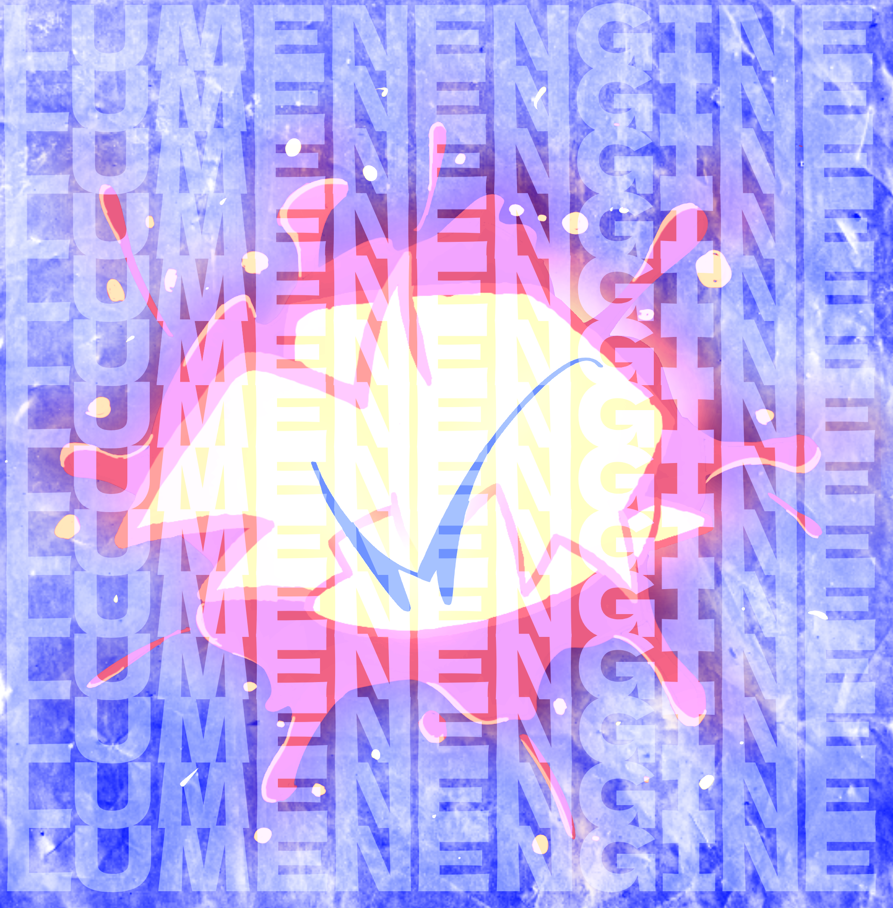

# fnf - lumen engine

basically an customized old version of [p-slice](https://github.com/Psych-Slice/P-Slice) to my liking. just an underground fork as far as this thing goes.

  

download the precompiled builds through github actions [you need a github account]

this engine is tailored for **my own mods**, with features, shortcuts, and quirks that only really make sense in that context.

if you're here, chances are you're digging through one of my example mods and got curious or whatever the reason may be. welcome.

credits to the devs behind p-slice, hybrid engine, and more shit i used

---

  

